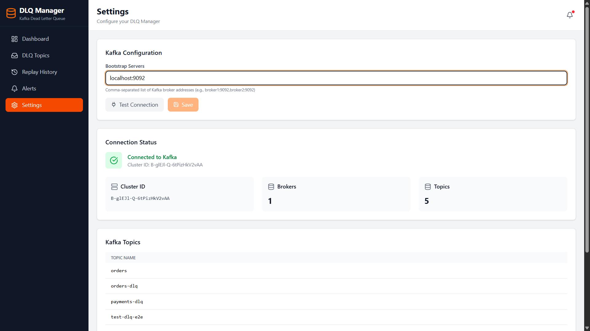
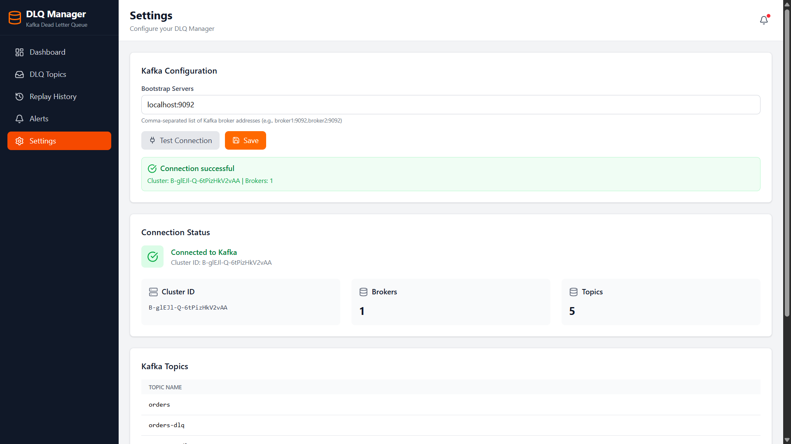
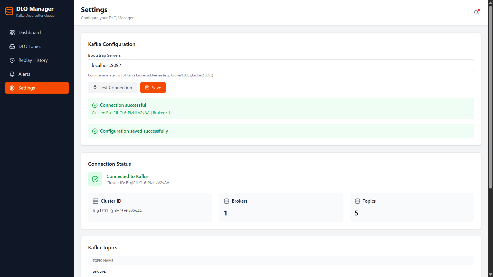
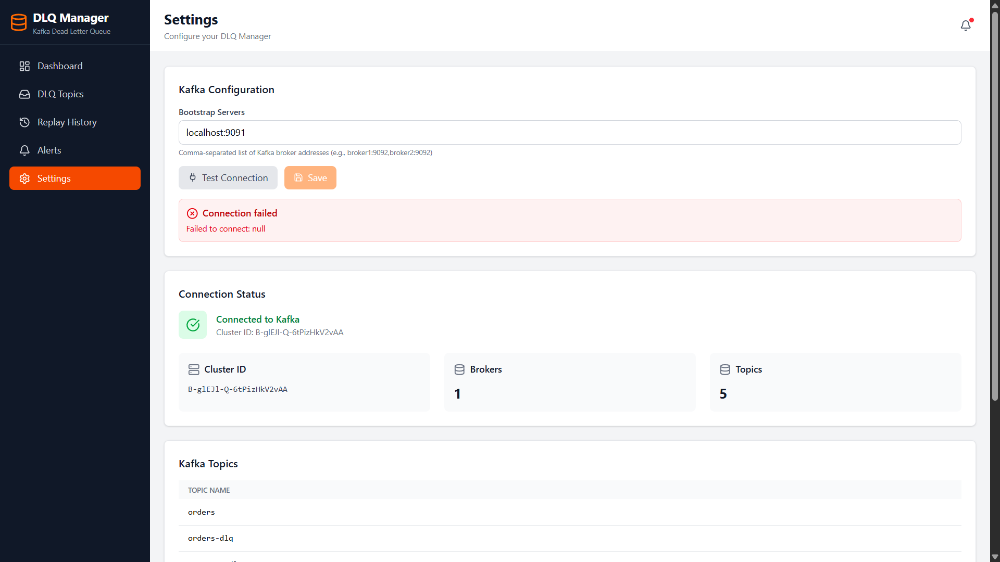

# Kafka DLQ Manager


A web-based Dead Letter Queue (DLQ) management dashboard for Apache Kafka. Browse failed messages, analyze error patterns, and replay messages back to source topics.

> Stop losing failed messages. Track, analyze, and replay with confidence.

---

## What is this?

When Kafka consumers fail to process messages, those messages often end up in a Dead Letter Queue (DLQ). This tool helps you:

- **See** what's in your DLQ topics
- **Understand** why messages failed (error breakdown)
- **Fix** issues by replaying messages back to the source topic
- **Track** all replay operations with an audit trail
- **Configure** Kafka connections dynamically from the UI

---

## Screenshots

<details>
<summary><strong>Dashboard</strong> — Overview of all DLQ topics, stats, and recent replays</summary>


</details>

<details>
<summary><strong>DLQ Topics</strong> — List, search, add, edit, and delete topic registrations</summary>


</details>

<details>
<summary><strong>Message Browser</strong> — Browse messages with error breakdown visualization</summary>


</details>

<details>
<summary><strong>Message Details</strong> — Full payload, headers, metadata, and single-message replay</summary>


</details>

<details>
<summary><strong>Replay History</strong> — Audit trail with status, success rates, and timestamps</summary>


</details>

<details>
<summary><strong>Settings</strong> — Kafka configuration, connection testing, and cluster info</summary>

**Configure bootstrap servers:**



**Test connection (Save enabled only after success):**



**Configuration saved:**



**Failed connection (Save stays disabled):**


</details>

---

## Features

### v1.0 — Core Platform
| Feature | Description |
|---------|-------------|
| DLQ Topic Management | Register DLQ topics and map them to source topics |
| Message Browser | Paginated view of messages with payload, headers, and metadata |
| Error Analytics | Error breakdown with percentages and visual bars |
| Message Replay | Replay single or bulk messages back to source topic |
| Replay History | Full audit trail of all replay operations |
| Auto-Discovery | Detect DLQ topics by naming convention (`*-dlq`, `*-error`) |
| Dashboard | Overview cards, topic list, recent replays |

### v2.0 — Dynamic Kafka Configuration
| Feature | Description |
|---------|-------------|
| Kafka Config UI | Configure bootstrap servers from the Settings page |
| Connection Testing | Test connectivity before saving — Save disabled until test passes |
| Persistent Config | Configuration stored in PostgreSQL, survives restarts |
| Hot Reload | Config changes take effect immediately — no backend restart needed |
| Fallback | Falls back to `application.properties` if no UI config is saved |

---

## Tech Stack

| Layer | Technology | Purpose |
|-------|------------|---------|
| Frontend | React 18 + TypeScript | UI framework with type safety |
| Frontend | Vite | Build tool and dev server |
| Frontend | Tailwind CSS 4 | Utility-first styling |
| Frontend | TanStack Query | Server state management and caching |
| Frontend | React Router | Client-side routing |
| Frontend | Axios | HTTP client with interceptors |
| Frontend | Lucide React | Icon library |
| Backend | Java 17 + Spring Boot 3.x | Application framework |
| Backend | Spring Data JPA | Database ORM |
| Backend | Apache Kafka Client | Direct Kafka consumer/producer |
| Database | PostgreSQL 15 | Metadata, audit trail, and configuration |
| Infra | Docker Compose | Local development stack |

---

## Quick Start

### Prerequisites

- Docker & Docker Compose
- Java 17+
- Node.js 18+

### 1. Start Infrastructure

```bash
git clone https://github.com/Surakattula-Rohith/dlq-manager.git
cd dlq-manager
docker-compose up -d
```

### 2. Start Backend

```bash
cd backend
./mvnw spring-boot:run
```

Runs at `http://localhost:8080`

### 3. Start Frontend

```bash
cd frontend
npm install
npm run dev
```

Open `http://localhost:5173`

### 4. Configure Kafka

Navigate to **Settings** (`/settings`), enter your bootstrap servers, click **Test Connection**, then **Save**.

### 5. Add Test Data (Optional)

```bash
docker exec dlq-kafka kafka-topics --create \
  --topic orders-dlq --bootstrap-server localhost:9092 --partitions 1

docker exec dlq-kafka kafka-topics --create \
  --topic orders --bootstrap-server localhost:9092 --partitions 1

cd backend
mvn exec:java -Dexec.mainClass="com.dlqmanager.util.TestDataProducer" -q
```

---

## Connect to Your Own Kafka

| Method | How | Restart Required? |
|--------|-----|:-----------------:|
| **Settings UI** (Recommended) | Go to `/settings`, enter servers, test, save | No |
| Environment variable | `export SPRING_KAFKA_BOOTSTRAP_SERVERS=host:9092` | Yes |
| Config file | Edit `application.properties` | Yes |

The Settings UI saves to the database and overrides the config file. If no UI config exists, the app falls back to `application.properties`.

---

## API Reference

### DLQ Management

| Method | Endpoint | Description |
|--------|----------|-------------|
| `GET` | `/api/dlq-topics` | List all registered DLQs |
| `POST` | `/api/dlq-topics` | Register new DLQ topic |
| `GET` | `/api/dlq-topics/{id}` | Get DLQ by ID |
| `PUT` | `/api/dlq-topics/{id}` | Update DLQ configuration |
| `DELETE` | `/api/dlq-topics/{id}` | Delete DLQ registration |

### Message Browsing & Analytics

| Method | Endpoint | Description |
|--------|----------|-------------|
| `GET` | `/api/dlq-topics/{id}/messages?page=1&size=10` | Browse messages (paginated) |
| `GET` | `/api/dlq-topics/{id}/message-count` | Total message count |
| `GET` | `/api/dlq-topics/{id}/error-breakdown` | Error type statistics |

### Message Replay

| Method | Endpoint | Description |
|--------|----------|-------------|
| `POST` | `/api/replay/single` | Replay single message |
| `POST` | `/api/replay/bulk` | Replay multiple messages |
| `GET` | `/api/replay/jobs/{id}` | Get replay job status |
| `GET` | `/api/replay/history` | All replay jobs |

### Kafka Operations

| Method | Endpoint | Description |
|--------|----------|-------------|
| `GET` | `/api/kafka/topics` | List all Kafka topics |
| `GET` | `/api/kafka/discover-dlqs` | Auto-discover DLQ topics |
| `GET` | `/api/kafka/cluster-info` | Cluster information |

### Kafka Configuration <sup>v2</sup>

| Method | Endpoint | Description |
|--------|----------|-------------|
| `GET` | `/api/kafka/config` | Get current config and status |
| `PUT` | `/api/kafka/config` | Save bootstrap servers |
| `POST` | `/api/kafka/config/test` | Test connection before saving |

---

## Architecture

```
┌──────────────────────────────────────────────────────────┐
│                       FRONTEND                           │
│                                                          │
│   Dashboard · DLQ Topics · Message Browser · Settings    │
│                        │                                 │
│              TanStack Query + Axios                      │
└──────────────────────────┬───────────────────────────────┘
                           │ REST API
┌──────────────────────────┼───────────────────────────────┐
│                       BACKEND                            │
│                          │                               │
│   Controllers ─── Services ─── Repositories              │
│                    │     │                               │
│              ┌─────┘     └─────┐                         │
│              ▼                 ▼                          │
│        ┌──────────┐     ┌──────────┐                     │
│        │PostgreSQL│     │  Kafka   │                     │
│        │ Config   │     │ Messages │                     │
│        │ Metadata │     │ Produce  │                     │
│        │ Audit    │     │ Consume  │                     │
│        └──────────┘     └──────────┘                     │
└──────────────────────────────────────────────────────────┘
```

---

## Project Structure

<details>
<summary><strong>Frontend</strong></summary>

```
frontend/src/
├── api/
│   ├── client.ts              # Axios instance with interceptors
│   ├── dlqTopics.ts           # DLQ topics endpoints
│   ├── replay.ts              # Replay endpoints
│   └── kafka.ts               # Kafka admin + config endpoints
├── components/layout/
│   ├── Sidebar.tsx            # Navigation sidebar
│   ├── Header.tsx             # Page header with refresh
│   └── Layout.tsx             # Main layout wrapper
├── pages/
│   ├── DashboardPage.tsx      # Home dashboard
│   ├── DlqTopicsPage.tsx      # Topics list and management
│   ├── DlqTopicDetailPage.tsx # Message browser
│   ├── ReplayHistoryPage.tsx  # Replay audit trail
│   ├── SettingsPage.tsx       # Kafka config + cluster info
│   └── AlertsPage.tsx         # Alerts (coming soon)
├── types/index.ts             # TypeScript interfaces
├── App.tsx                    # Router setup
└── main.tsx                   # Entry point
```
</details>

<details>
<summary><strong>Backend</strong></summary>

```
backend/src/main/java/com/dlqmanager/
├── controller/
│   ├── DlqTopicController.java      # DLQ CRUD endpoints
│   ├── ReplayController.java        # Replay endpoints
│   ├── KafkaController.java         # Kafka admin endpoints
│   └── KafkaConfigController.java   # Kafka config endpoints (v2)
├── service/
│   ├── DlqBrowserService.java       # Message browsing logic
│   ├── ReplayService.java           # Replay orchestration
│   ├── KafkaAdminService.java       # Kafka admin operations
│   └── KafkaConfigService.java      # Dynamic config management (v2)
├── repository/
│   ├── DlqTopicRepository.java
│   ├── ReplayJobRepository.java
│   └── KafkaConfigRepository.java   # (v2)
├── model/
│   ├── entity/                      # JPA entities (incl. KafkaConfig)
│   ├── dto/                         # Request/Response DTOs
│   └── enums/
└── config/
    └── KafkaProducerConfig.java     # Idempotent producer setup
```
</details>

---

## Message Header Format

DLQ messages should include these headers for full functionality:

| Header | Purpose |
|--------|---------|
| `X-Error-Message` | Error description |
| `X-Original-Topic` | Source topic name |
| `X-Consumer-Group` | Consumer group that failed |
| `X-Retry-Count` | Number of retry attempts |
| `X-Exception-Class` | Java exception class name |
| `X-Failed-Timestamp` | Failure time (epoch ms) |

---

## Roadmap

- [x] **Phase 1** — DLQ Topic Management (CRUD)
- [x] **Phase 2** — Message Browsing & Error Analytics
- [x] **Phase 3** — Message Replay (single & bulk)
- [x] **Phase 4** — Frontend Dashboard (React + Tailwind)
- [ ] **Phase 5** — Alerting & Notifications
- [x] **Phase 6** — Dynamic Kafka Configuration
- [ ] **Phase 7** — Authentication & RBAC
- [ ] **Phase 8** — Multi-cluster Support

See [TODO.md](TODO.md) for the detailed backlog.

---

## Current Limitations

| Area | Limitation | Priority |
|------|-----------|----------|
| Auth | No authentication or login | High |
| Kafka | Single cluster only | Medium |
| Kafka | No SASL/SSL support | Medium |
| Alerts | No DLQ threshold alerts | Medium |
| Notifications | No Slack/Email integration | Low |

---

## Development

```bash
# Frontend
cd frontend && npm install && npm run dev    # http://localhost:5173

# Backend
cd backend && ./mvnw spring-boot:run         # http://localhost:8080

# Infrastructure
docker-compose up -d                         # Kafka + PostgreSQL + Redis
```

---

## Contributing

Contributions welcome. Fork the repo, create a branch, and submit a PR.

## License

AGPL-3.0 — See [LICENSE](LICENSE) for details.

## Author

**Rohith Surakattula**
[GitHub](https://github.com/Surakattula-Rohith) · [LinkedIn](https://www.linkedin.com/in/surakattula-rohith-511315264/)
