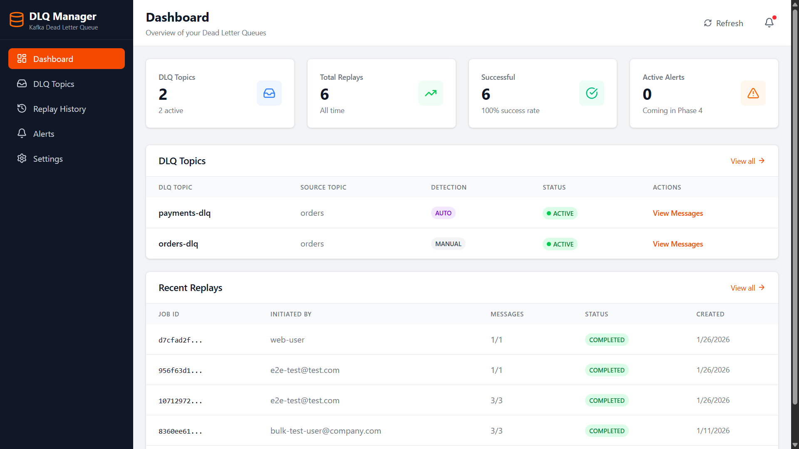
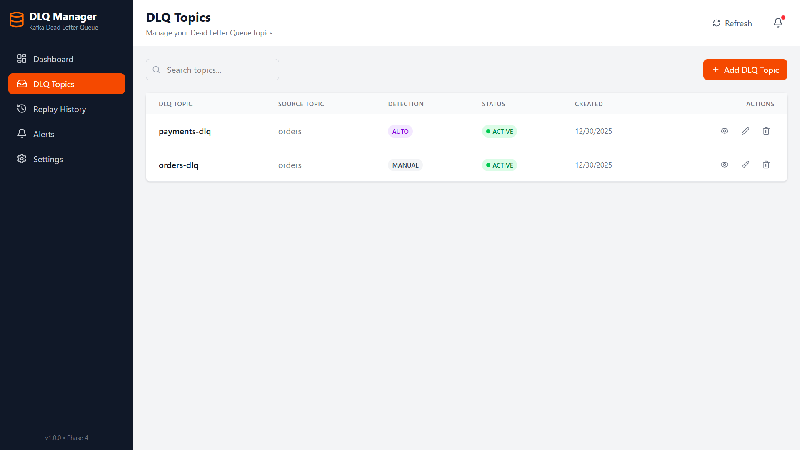
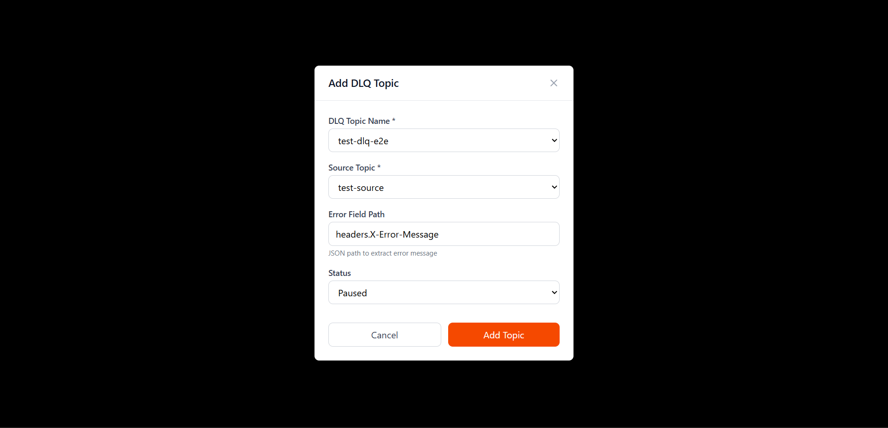
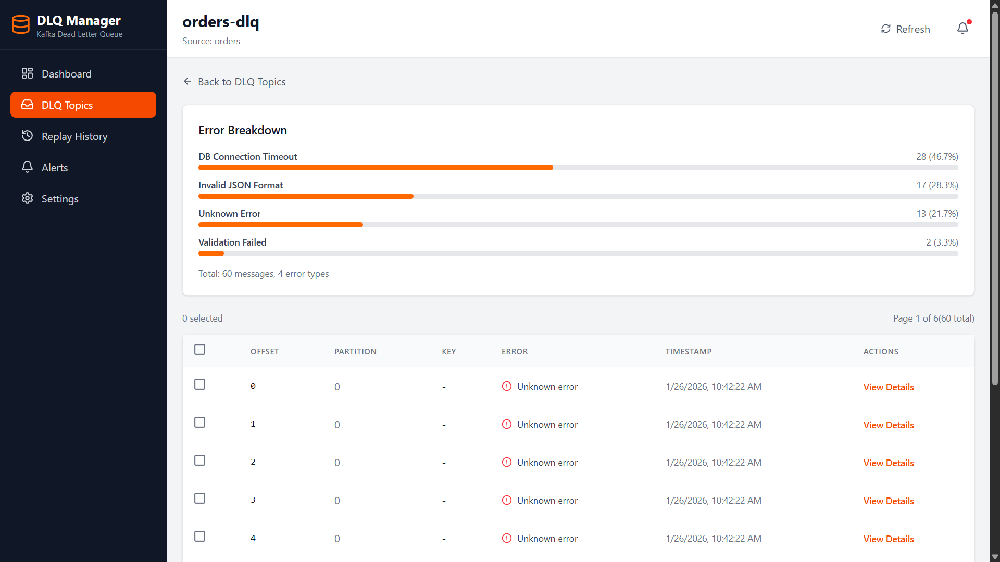
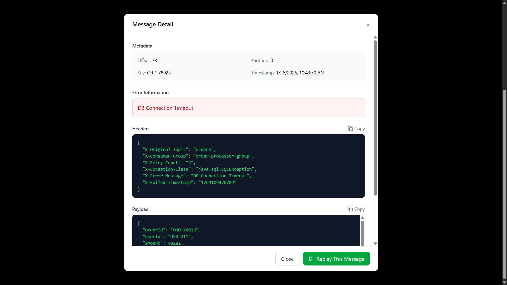
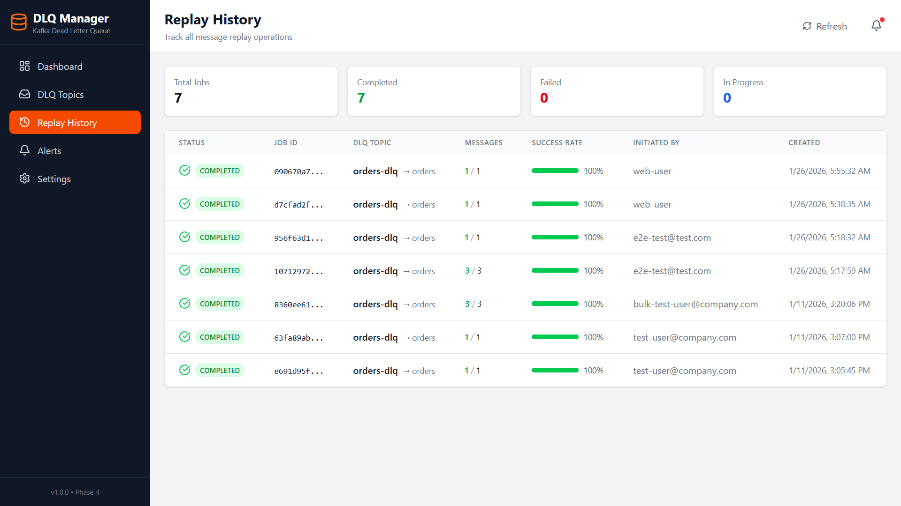
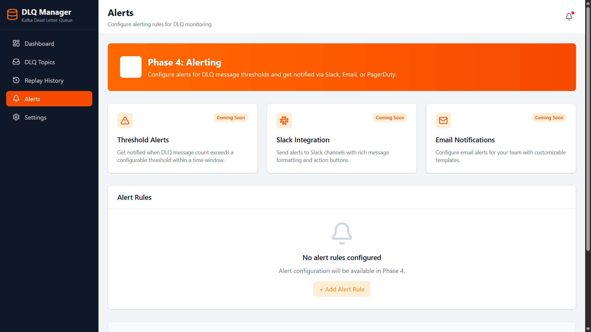

# Kafka DLQ Manager


A web-based Dead Letter Queue (DLQ) management dashboard for Apache Kafka. Browse failed messages, analyze error patterns, and replay messages back to source topics.

> Stop losing failed messages. Track, analyze, and replay with confidence.

## What is this?

When Kafka consumers fail to process messages, those messages often end up in a Dead Letter Queue (DLQ). This tool helps you:

- **See** what's in your DLQ topics
- **Understand** why messages failed (error breakdown)
- **Fix** issues by replaying messages back to the source topic
- **Track** all replay operations with an audit trail

## Screenshots

### Dashboard
Overview of all DLQ topics, summary stats, and recent replay activity.



### DLQ Topics Management
List, search, add, edit, and delete DLQ topic registrations.





### Message Browser & Error Analytics
Browse messages in a DLQ topic with error breakdown visualization.



### Message Details
View full message payload, headers, metadata, and replay individual messages.



### Replay History
Track all replay operations with status, success rates, and timestamps.



### Settings
View Kafka cluster connection status and all topics.


### Alerts (Coming Soon)
Phase 5 will add threshold alerts, Slack, and email notifications.



---

## Features

### Core Features
| Feature | Description |
|---------|-------------|
| **DLQ Topic Management** | Register DLQ topics and map them to source topics |
| **Message Browser** | Paginated view of messages with payload, headers, and metadata |
| **Error Analytics** | See which errors are most common (with percentages) |
| **Message Replay** | Replay single or bulk messages back to source topic |
| **Replay History** | Full audit trail of all replay operations |
| **Auto-Discovery** | Detect DLQ topics by naming convention (`*-dlq`, `*-error`) |

### UI Features
| Page | What you can do |
|------|-----------------|
| **Dashboard** | Overview cards, topic list, recent replays |
| **DLQ Topics** | Add, edit, delete, search topics |
| **Topic Detail** | Browse messages, see error breakdown, select & replay |
| **Replay History** | View all jobs with success rates and timestamps |
| **Settings** | See Kafka cluster status and connection info |

## Tech Stack

### Frontend
| Technology | Purpose |
|------------|---------|
| React 18 | UI Framework |
| TypeScript | Type Safety |
| Vite | Build Tool & Dev Server |
| Tailwind CSS 4 | Styling |
| React Router 6 | Client-side Routing |
| TanStack Query | Server State Management |
| Axios | HTTP Client |
| Lucide React | Icons |
| Recharts | Charts (for analytics) |

### Backend
| Technology | Purpose |
|------------|---------|
| Java 17 | Runtime |
| Spring Boot 3.x | Framework |
| Spring Data JPA | Database ORM |
| Spring Kafka | Kafka Integration |
| PostgreSQL 15 | Metadata & Audit Storage |
| Apache Kafka 3.x | Message Queue |

## Quick Start (Demo Mode)

This will start the app with a **demo Kafka cluster** running locally in Docker.

### Prerequisites
- Docker & Docker Compose
- Java 17+
- Node.js 18+

### Step 1: Clone and Start Infrastructure
```bash
git clone https://github.com/Surakattula-Rohith/dlq-manager.git
cd dlq-manager

# Start Kafka, Zookeeper, and PostgreSQL
docker-compose up -d
```

### Step 2: Start Backend
```bash
cd backend
./mvnw spring-boot:run
```
Backend runs at: `http://localhost:8080`

### Step 3: Start Frontend
```bash
cd frontend
npm install
npm run dev
```
Open: `http://localhost:5173`

### Step 4: Add Test Data (Optional)
```bash
# Create a test DLQ topic
docker exec dlq-kafka kafka-topics --create \
  --topic orders-dlq \
  --bootstrap-server localhost:9092 \
  --partitions 1

# Create the source topic
docker exec dlq-kafka kafka-topics --create \
  --topic orders \
  --bootstrap-server localhost:9092 \
  --partitions 1

# Generate 50 test messages with different error types
cd backend
mvn exec:java -Dexec.mainClass="com.dlqmanager.util.TestDataProducer" -q
```

---

## Connect to Your Own Kafka

> **Note:** Currently, Kafka configuration requires editing config files. A UI-based setup is planned for a future release.

### Option 1: Environment Variables
```bash
# Set before starting the backend
export SPRING_KAFKA_BOOTSTRAP_SERVERS=your-kafka-host:9092

cd backend
./mvnw spring-boot:run
```

### Option 2: Edit Configuration File
Edit `backend/src/main/resources/application.yml`:
```yaml
spring:
  kafka:
    bootstrap-servers: your-kafka-host:9092
```

### Option 3: Docker Compose Override
Create `docker-compose.override.yml`:
```yaml
services:
  # Comment out or remove the kafka and zookeeper services
  # if using external Kafka
```

Then set the backend to connect to your Kafka cluster.

---

## Frontend Pages

### Dashboard (`/`)
- Summary cards showing total DLQ topics, replays, success rate, and alerts
- DLQ topics table with status indicators
- Recent replay jobs list
- Quick navigation to topic details

### DLQ Topics (`/dlq-topics`)
- Searchable list of all registered DLQ topics
- Add new DLQ topic with modal form
- Edit existing topic configuration
- Delete topics with confirmation
- Status badges (Active/Paused, Auto/Manual detection)

### Topic Detail (`/dlq-topics/:id`)
- Error breakdown visualization with progress bars
- Paginated message table with selection checkboxes
- Bulk replay selected messages
- Message detail modal with:
  - Metadata (offset, partition, key, timestamp)
  - Error information with exception class
  - Full headers view (JSON formatted)
  - Full payload view (JSON formatted)
  - Copy to clipboard functionality
  - Single message replay button

### Replay History (`/replay-history`)
- List of all replay jobs with filtering
- Status indicators (Completed, Failed, In Progress, Partial)
- Success rate progress bars
- Job details including message counts and timestamps

### Settings (`/settings`)
- Kafka cluster connection status
- Controller node information
- Cluster nodes list
- All Kafka topics with partition counts
- API configuration

## Frontend Structure

```
frontend/
├── src/
│   ├── api/                    # API layer
│   │   ├── client.ts           # Axios instance with interceptors
│   │   ├── dlqTopics.ts        # DLQ topics endpoints
│   │   ├── replay.ts           # Replay endpoints
│   │   └── kafka.ts            # Kafka admin endpoints
│   ├── components/
│   │   └── layout/
│   │       ├── Sidebar.tsx     # Navigation sidebar
│   │       ├── Header.tsx      # Page header with refresh
│   │       └── Layout.tsx      # Main layout wrapper
│   ├── pages/
│   │   ├── DashboardPage.tsx   # Home dashboard
│   │   ├── DlqTopicsPage.tsx   # Topics list & management
│   │   ├── DlqTopicDetailPage.tsx  # Message browser
│   │   ├── ReplayHistoryPage.tsx   # Replay jobs list
│   │   ├── AlertsPage.tsx      # Alerts (Phase 4)
│   │   └── SettingsPage.tsx    # Configuration
│   ├── types/
│   │   └── index.ts            # TypeScript interfaces
│   ├── App.tsx                 # Router setup
│   └── main.tsx                # Entry point
├── tailwind.config.js
├── vite.config.ts              # Vite config with API proxy
└── package.json
```

## Backend Structure

```
backend/
└── src/main/java/com/dlqmanager/
    ├── controller/
    │   ├── DlqTopicController.java   # DLQ CRUD endpoints
    │   ├── ReplayController.java     # Replay endpoints
    │   └── KafkaController.java      # Kafka admin endpoints
    ├── service/
    │   ├── DlqBrowserService.java    # Message browsing logic
    │   ├── ReplayService.java        # Replay orchestration
    │   └── KafkaAdminService.java    # Kafka admin operations
    ├── repository/
    │   ├── DlqTopicRepository.java
    │   └── ReplayJobRepository.java
    ├── model/
    │   ├── entity/                   # JPA entities
    │   ├── dto/                      # Request/Response DTOs
    │   └── enums/
    └── config/
        └── KafkaProducerConfig.java  # Idempotent producer
```

## API Reference

### DLQ Management
| Method | Endpoint | Description |
|--------|----------|-------------|
| GET | `/api/dlq-topics` | List all registered DLQs |
| POST | `/api/dlq-topics` | Register new DLQ topic |
| GET | `/api/dlq-topics/{id}` | Get DLQ by ID |
| PUT | `/api/dlq-topics/{id}` | Update DLQ configuration |
| DELETE | `/api/dlq-topics/{id}` | Delete DLQ registration |

### Message Browsing & Analytics
| Method | Endpoint | Description |
|--------|----------|-------------|
| GET | `/api/dlq-topics/{id}/messages?page=1&size=10` | Browse messages |
| GET | `/api/dlq-topics/{id}/message-count` | Get total message count |
| GET | `/api/dlq-topics/{id}/error-breakdown` | Get error statistics |

### Message Replay
| Method | Endpoint | Description |
|--------|----------|-------------|
| POST | `/api/replay/single` | Replay single message |
| POST | `/api/replay/bulk` | Replay multiple messages |
| GET | `/api/replay/jobs/{id}` | Get replay job status |
| GET | `/api/replay/history` | Get all replay jobs |

### Kafka Operations
| Method | Endpoint | Description |
|--------|----------|-------------|
| GET | `/api/kafka/topics` | List all Kafka topics |
| GET | `/api/kafka/discover-dlqs` | Auto-discover DLQ topics |
| GET | `/api/kafka/cluster-info` | Get cluster information |

## Usage Examples

### Register a DLQ Topic
```bash
curl -X POST http://localhost:8080/api/dlq-topics \
  -H "Content-Type: application/json" \
  -d '{
    "dlqTopicName": "orders-dlq",
    "sourceTopic": "orders",
    "detectionType": "MANUAL",
    "errorFieldPath": "headers.X-Error-Message"
  }'
```

### Get Error Breakdown
```bash
curl "http://localhost:8080/api/dlq-topics/{id}/error-breakdown"
```

Response:
```json
{
  "success": true,
  "totalMessages": 51,
  "errorBreakdown": [
    {
      "errorType": "DB Connection Timeout",
      "count": 32,
      "percentage": 62.75
    },
    {
      "errorType": "Invalid JSON Format",
      "count": 12,
      "percentage": 23.53
    }
  ]
}
```

### Replay Messages (Bulk)
```bash
curl -X POST http://localhost:8080/api/replay/bulk \
  -H "Content-Type: application/json" \
  -d '{
    "dlqTopicId": "abc-123-uuid",
    "messages": [
      {"offset": 51, "partition": 0},
      {"offset": 52, "partition": 0}
    ],
    "initiatedBy": "admin@example.com"
  }'
```

Response:
```json
{
  "success": true,
  "message": "All 2 messages replayed successfully",
  "replayJob": {
    "id": "job-uuid",
    "status": "COMPLETED",
    "totalMessages": 2,
    "succeeded": 2,
    "failed": 0,
    "successRate": 100.0
  }
}
```

## Architecture

```
┌─────────────────────────────────────────────────────────────────┐
│                        FRONTEND                                  │
│  ┌───────────┐ ┌───────────┐ ┌───────────┐ ┌───────────┐       │
│  │ Dashboard │ │DLQ Topics │ │  Message  │ │  Replay   │       │
│  │   Page    │ │   Page    │ │  Browser  │ │  History  │       │
│  └───────────┘ └───────────┘ └───────────┘ └───────────┘       │
│         │            │             │             │               │
│  ┌──────┴────────────┴─────────────┴─────────────┴──────┐      │
│  │              TanStack Query + Axios                   │      │
│  └──────────────────────────┬────────────────────────────┘      │
└─────────────────────────────┼───────────────────────────────────┘
                              │ HTTP/REST
┌─────────────────────────────┼───────────────────────────────────┐
│                        BACKEND                                   │
│  ┌──────────────────────────┴────────────────────────────┐      │
│  │                    REST API Layer                      │      │
│  │  DlqTopicController · ReplayController · KafkaController     │
│  └──────────────────────────┬────────────────────────────┘      │
│                              │                                   │
│  ┌──────────────────────────┴────────────────────────────┐      │
│  │                    Service Layer                       │      │
│  │  DlqBrowserService · ReplayService · KafkaAdminService │      │
│  └────────────┬─────────────────────────────┬────────────┘      │
│               │                             │                    │
│               ▼                             ▼                    │
│        ┌────────────┐                ┌────────────┐             │
│        │ PostgreSQL │                │   Kafka    │             │
│        │  Metadata  │                │  Messages  │             │
│        │   Audit    │                │  Produce   │             │
│        │   Trail    │                │  Consume   │             │
│        └────────────┘                └────────────┘             │
└─────────────────────────────────────────────────────────────────┘
```

## Development

### Frontend Development
```bash
cd frontend
npm install          # Install dependencies
npm run dev          # Start dev server (http://localhost:5173)
npm run build        # Production build
npm run preview      # Preview production build
```

### Backend Development
```bash
cd backend
./mvnw spring-boot:run              # Start server
./mvnw test                         # Run tests
./mvnw package -DskipTests          # Build JAR
```

### Environment Variables

**Frontend** (`.env` or `vite.config.ts`):
```
VITE_API_URL=http://localhost:8080   # Backend URL (optional, uses proxy in dev)
```

**Backend** (`application.yml`):
```yaml
spring:
  kafka:
    bootstrap-servers: localhost:9092
  datasource:
    url: jdbc:postgresql://localhost:5432/dlqmanager
```

## Message Header Format

DLQ messages should include these headers for full functionality:

```
X-Error-Message: Error description
X-Original-Topic: Source topic name
X-Consumer-Group: Consumer group name
X-Retry-Count: Number of retry attempts
X-Exception-Class: Java exception class
X-Failed-Timestamp: Epoch milliseconds
```

## Current Limitations

This is a work-in-progress project. Here's what's **not yet implemented**:

| Limitation | Status |
|------------|--------|
| Kafka cluster is hardcoded (no UI to configure) | Planned |
| No authentication/login | Planned |
| No alerting when DLQ fills up | Phase 5 |
| No Slack/Email notifications | Phase 5 |
| Single cluster only (no multi-cluster) | Planned |

See [TODO.md](TODO.md) for the full list of planned improvements.

---

## Roadmap

- [x] **Phase 1:** DLQ Topic Management (CRUD operations)
- [x] **Phase 2:** Message Browsing & Error Analytics
- [x] **Phase 3:** Message Replay (single & bulk)
- [x] **Phase 4:** Frontend Dashboard (React + Tailwind)
- [ ] **Phase 5:** Alerting & Notifications (Slack, Email, PagerDuty)
- [ ] **Phase 6:** Dynamic Kafka Configuration (UI-based setup)
- [ ] **Phase 7:** Authentication & Multi-tenancy

---

## Contributing

Contributions welcome. Fork the repo, create a branch, and submit a PR.

## License

AGPL-3.0 — See [LICENSE](LICENSE) for details.

## Author

**Rohith Surakattula**
[GitHub](https://github.com/Surakattula-Rohith) · [LinkedIn](https://www.linkedin.com/in/surakattula-rohith-511315264/)
