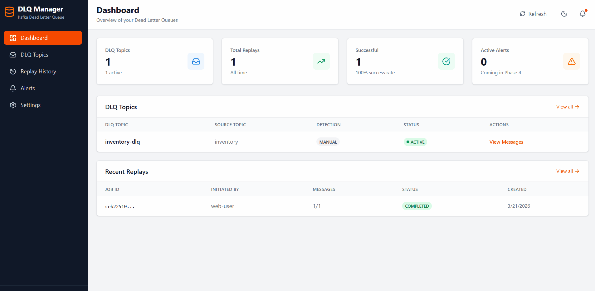

# Kafka DLQ Manager


A full-stack dashboard for managing Kafka Dead Letter Queues — browse failed messages, analyze error patterns, replay them back to source topics, and get alerted when things go wrong.

> Here's a quick demo of the full flow — browsing DLQ messages, replaying them, and viewing alert history.



---

## Why I built this

When Kafka consumers fail, messages land in a DLQ and stay there — invisible, untracked, silently growing. Most teams deal with this by writing one-off scripts or digging through CLI tools. I wanted a proper UI for it: something that shows you what failed, why it failed, and lets you fix it without leaving the browser.

This project started as a weekend experiment and has grown into a full platform over 4 weekly iterations, each shipped as a LinkedIn update.

---

## What it does

- **Browse** failed messages across all your DLQ topics, paginated
- **Analyze** error patterns with a per-topic error breakdown
- **Replay** single or bulk messages back to the source topic
- **Track** every replay operation with a full audit trail
- **Configure** Kafka connections from the UI — no restart needed
- **Alert** when a DLQ crosses a threshold, with Slack notifications

---

## Build History

Each version was shipped and documented independently.

**v1.0 — Core Platform**
The foundation: DLQ topic management, a message browser with pagination, error analytics, single and bulk replay, and a full replay audit trail. Auto-discovery detects DLQ topics by naming convention (`*-dlq`, `*-error`).

**v2.0 — Dynamic Kafka Configuration**
Added a Settings page to configure bootstrap servers from the UI, with a connection test that must pass before saving. Config is stored in PostgreSQL and takes effect immediately — no backend restart.

**v3.0 — Dark Mode**
Full dark mode across every page, input, table, modal, and card. Persisted across sessions.

**v4.0 — Alerting & Notifications**
Threshold and time-window alert rules per DLQ topic. Alert history with Acknowledge and Snooze actions. Cooldown support to prevent alert spam. Slack notifications via incoming webhooks.

---

## Tech Stack

| Layer | Technology |
|-------|------------|
| Frontend | React 18, TypeScript, Vite, Tailwind CSS 4 |
| State | TanStack Query, React Router, Axios |
| Backend | Java 17, Spring Boot 3.x, Spring Data JPA |
| Messaging | Apache Kafka Client (consumer + producer) |
| Database | PostgreSQL 15 |
| Infra | Docker Compose |

---

## Quick Start

**Prerequisites:** Docker, Java 17+, Node.js 18+

```bash
# 1. Start infrastructure (Kafka + PostgreSQL)
git clone https://github.com/Surakattula-Rohith/dlq-manager.git
cd dlq-manager
docker-compose up -d

# 2. Start backend
cd backend && ./mvnw spring-boot:run      # http://localhost:8080

# 3. Start frontend
cd frontend && npm install && npm run dev  # http://localhost:5173
```

Then go to **Settings**, enter your Kafka bootstrap servers, click **Test Connection**, and **Save**.

---

## Screenshots

<details>
<summary><strong>Dashboard & Topics</strong></summary>


</details>

<details>
<summary><strong>Message Browser & Replay</strong></summary>


</details>

<details>
<summary><strong>Alerts & Slack Notifications</strong></summary>


</details>

<details>
<summary><strong>Settings</strong></summary>


</details>

---

## API Reference

<details>
<summary><strong>Endpoints</strong></summary>

### DLQ Topics
| Method | Endpoint | Description |
|--------|----------|-------------|
| `GET` | `/api/dlq-topics` | List all registered DLQs |
| `POST` | `/api/dlq-topics` | Register new DLQ topic |
| `PUT` | `/api/dlq-topics/{id}` | Update DLQ configuration |
| `DELETE` | `/api/dlq-topics/{id}` | Delete DLQ registration |
| `GET` | `/api/dlq-topics/{id}/messages` | Browse messages (paginated) |
| `GET` | `/api/dlq-topics/{id}/error-breakdown` | Error type statistics |

### Replay
| Method | Endpoint | Description |
|--------|----------|-------------|
| `POST` | `/api/replay/single` | Replay single message |
| `POST` | `/api/replay/bulk` | Replay multiple messages |
| `GET` | `/api/replay/history` | All replay jobs |

### Kafka & Configuration
| Method | Endpoint | Description |
|--------|----------|-------------|
| `GET` | `/api/kafka/cluster-info` | Cluster information |
| `GET` | `/api/kafka/discover-dlqs` | Auto-discover DLQ topics |
| `GET` | `/api/kafka/config` | Get current config |
| `PUT` | `/api/kafka/config` | Save bootstrap servers |
| `POST` | `/api/kafka/config/test` | Test connection |

### Alerts
| Method | Endpoint | Description |
|--------|----------|-------------|
| `GET` | `/api/alert-rules` | List alert rules |
| `POST` | `/api/alert-rules` | Create alert rule |
| `PUT` | `/api/alert-rules/{id}` | Update alert rule |
| `PATCH` | `/api/alert-rules/{id}/toggle` | Enable/disable rule |
| `DELETE` | `/api/alert-rules/{id}` | Delete rule |
| `GET` | `/api/alert-events` | Alert history |
| `POST` | `/api/alert-events/{id}/acknowledge` | Acknowledge alert |
| `POST` | `/api/alert-events/{id}/snooze` | Snooze alert |
| `GET` | `/api/notification-channels` | List channels |
| `POST` | `/api/notification-channels` | Create channel |
| `POST` | `/api/notification-channels/{id}/test` | Test channel |

</details>

---

## Roadmap

- [x] v1.0 — DLQ browsing, error analytics, message replay
- [x] v2.0 — Dynamic Kafka configuration from UI
- [x] v3.0 — Dark mode
- [x] v4.0 — Alerting with Slack notifications
- [ ] v5.0 — Authentication & RBAC
- [ ] v6.0 — Multi-cluster support

See [TODO.md](TODO.md) for the full backlog.

---

## Author

**Rohith Surakattula**
[GitHub](https://github.com/Surakattula-Rohith) · [LinkedIn](https://www.linkedin.com/in/surakattula-rohith-511315264/)
